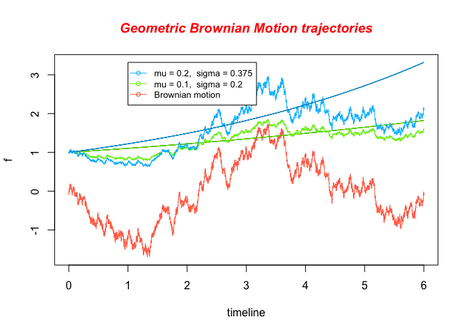

    maturity <- 6
    simulation.length <- 10001
    dt <-  maturity/(simulation.length-1)

    timeline <- seq(0,maturity, dt)

    S0<-1
    r<-0.05
    mu<-0.1
    mu0<-0.2
    sigma<-0.2
    sigma0<-0.375

    f <- g <- g0 <- h <- h0 <- rep(0, times=simulation.length)
    g0[1] <- h0[1] <- g[1] <-  h[1] <- S0

    for(i in 2:simulation.length){
         f[i] <- f[i-1]+sqrt(dt)*rnorm(1)
         g[i] <- g[1]*exp((mu-(sigma^2)/2)*(i-1)*dt+sigma*f[i])
         g0[i] <- g0[1]*exp(mu*(i-1)*dt)
         h[i] <- h[1]*exp((mu0-sigma0^2/2)*(i-1)*dt+sigma0*f[i])
         h0[i] <- h0[1]*exp(mu0*(i-1)*dt)
    }

    o_range <- range(f,g,g0,h,h0)

    plot(timeline,f, ylim=o_range, type="l", col="coral1")
    lines(timeline,g0, col="chartreuse3")
    lines(timeline,g, col="chartreuse2")
    lines(timeline,h, col="deepskyblue1")
    lines(timeline,h0, col="deepskyblue3")

    title(main="Geometric Brownian Motion trajectories", col.main="red", font.main=4)

    legend(1, o_range[2], c("mu = 0.2,  sigma = 0.375","mu = 0.1,  sigma = 0.2","Brownian motion"), cex=0.8, 
           col=c("deepskyblue1","chartreuse2","coral1"), pch=1, lty=1);

